<div align="center">

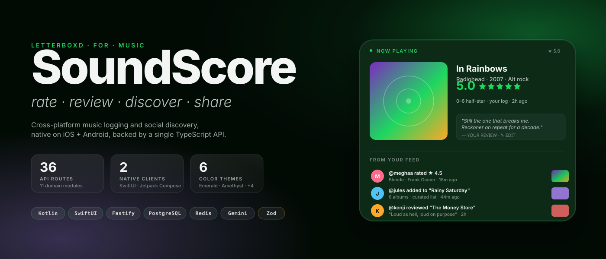

[](#-getting-started)
[](#-getting-started)
[](#-architecture)
[](#-tech-stack)
[](#-architecture)
[](#-architecture)
[](#-feature-spotlights)
[](#-license)
[](#-contributing)

**Log what you listen to · rate in half-stars · follow friends · discover new sound.**

[Overview](#-overview) · [Screens](#-ios-screens) · [Capabilities](#-capabilities) · [Architecture](#-architecture) · [Spotlights](#-feature-spotlights) · [Tech](#-tech-stack) · [Get started](#-getting-started) · [Contribute](#-contributing)

</div>

---

## 🎯 Overview

**SoundScore** is a cross-platform music logging and social discovery app — think _Letterboxd, but for albums_.

Rate albums on a real **0–6 scale with half-star precision**. Write reviews. Build curated lists. Follow friends and react to what they're spinning. Get **Gemini-powered recommendations** based on what you actually rate. All delivered through **native iOS + Android clients** backed by a single **TypeScript / Fastify** API and shared **Zod** contracts.

> This is an **open-source sandbox project.** Built as a learning exercise and creative outlet. If you find it interesting, want to pick up where I left off, or want to contribute — go for it.

<div align="center">

| Clients | Backend | Database | Cache | AI |
|:---:|:---:|:---:|:---:|:---:|
| SwiftUI + Compose | Fastify · Zod · Pino | PostgreSQL 15 | Redis | Gemini |

</div>

---

## 📱 iOS screens

<p align="center">
  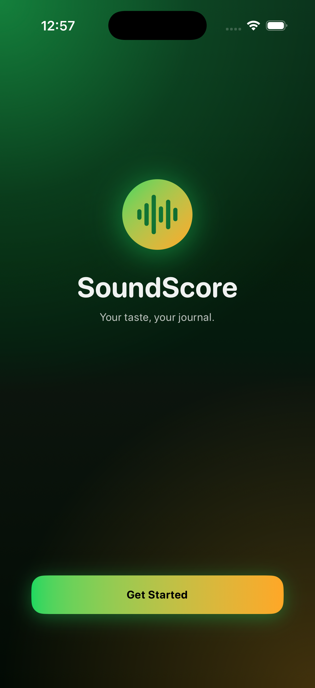
  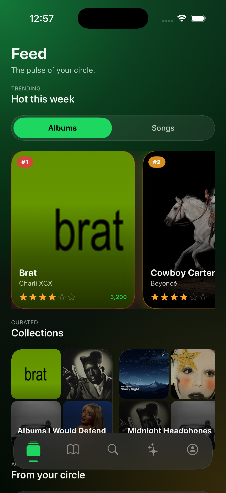
  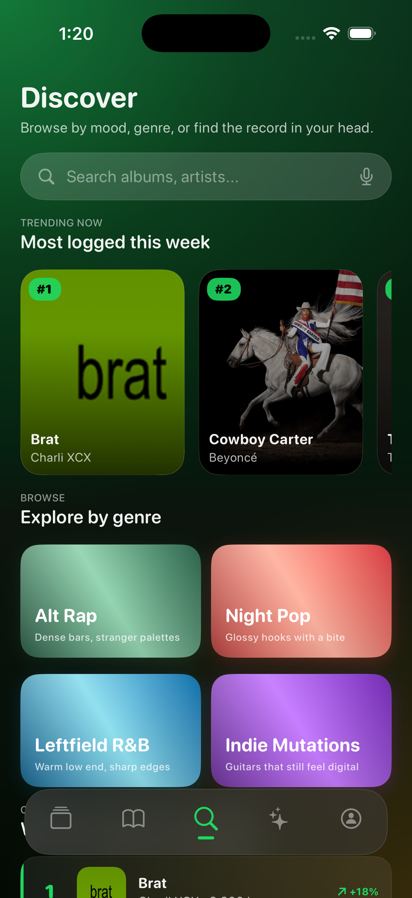
  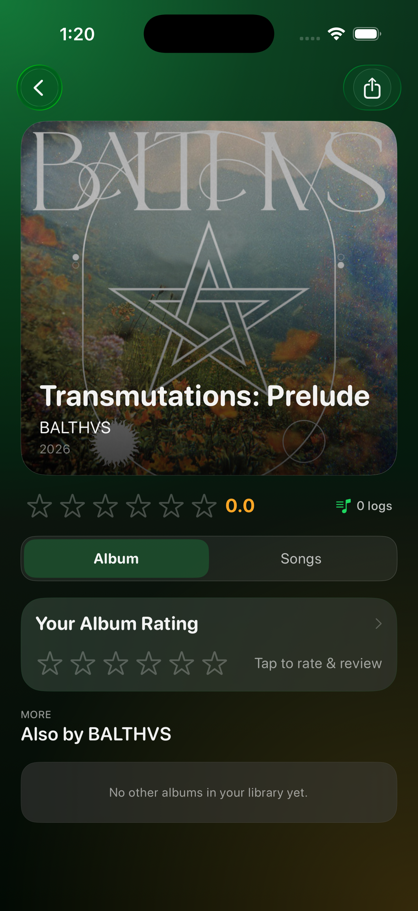
</p>

<p align="center">
  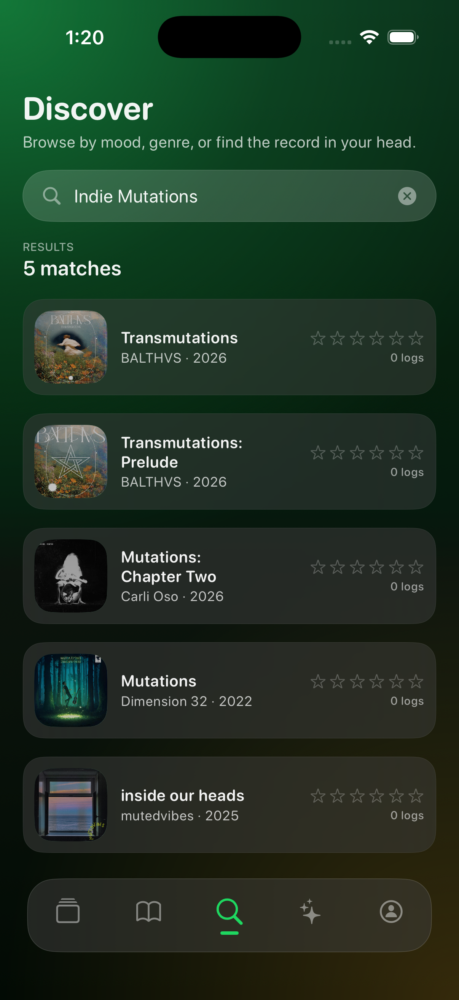
  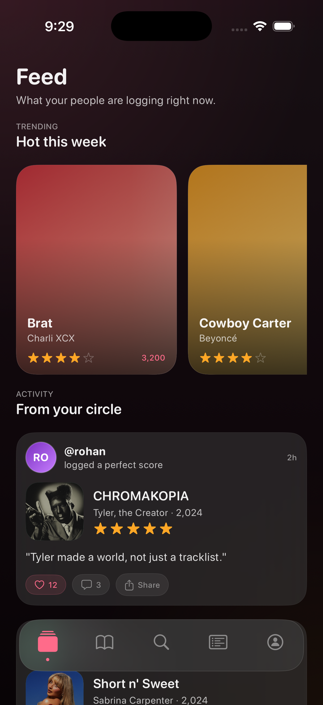
</p>

<p align="center"><em>Live screenshots from the shipping SwiftUI build · emerald theme.</em></p>

---

## ✨ Capabilities

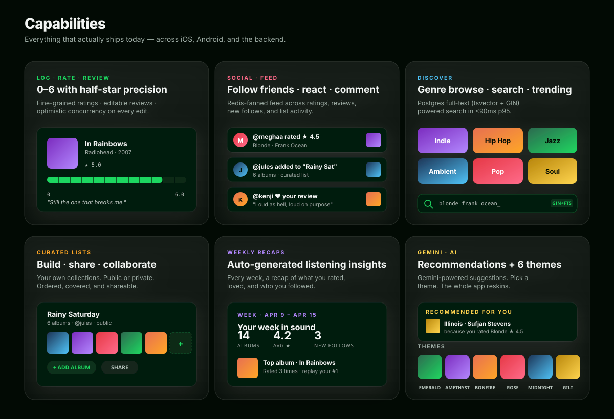

| # | Capability | What it does | Status |
|---|-----------|-------------|:------:|
| 1 | **Log · Rate · Review** | 0–6 rating with half-star precision; editable reviews with optimistic concurrency | ✅ |
| 2 | **Social feed** | Follow users, see their logs / reviews / lists, react and comment — Redis-fanned | ✅ |
| 3 | **Discover** | Genre browsing, Postgres full-text search (tsvector + GIN), trending | ✅ |
| 4 | **Curated lists** | Public or private album collections, ordered, shareable | ✅ |
| 5 | **Weekly recaps** | Auto-generated insights: albums logged, avg rating, top pick, new follows | ✅ |
| 6 | **Push notifications** | Follow alerts, reactions, comments — via `push` module | ✅ |
| 7 | **Theming** | 6 accent themes reskin the entire app — Emerald · Amethyst · Bonfire · Rose · Midnight · Gilt | ✅ |
| 8 | **GDPR tooling** | Full account data export + deletion | ✅ |
| 9 | **Gemini recs** | Recommendation engine wired on backend, mobile integration pending | 🛠 |
| 10 | **Spotify OAuth** | Listening history import + sync, provider-agnostic canonical album mapping | 🛠 |

---

## 🏗️ Architecture

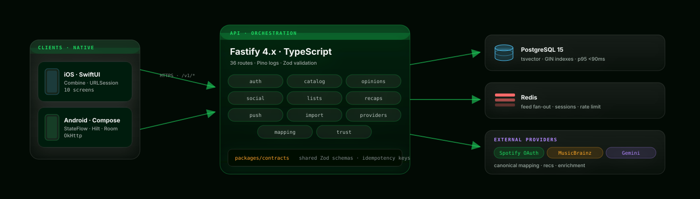

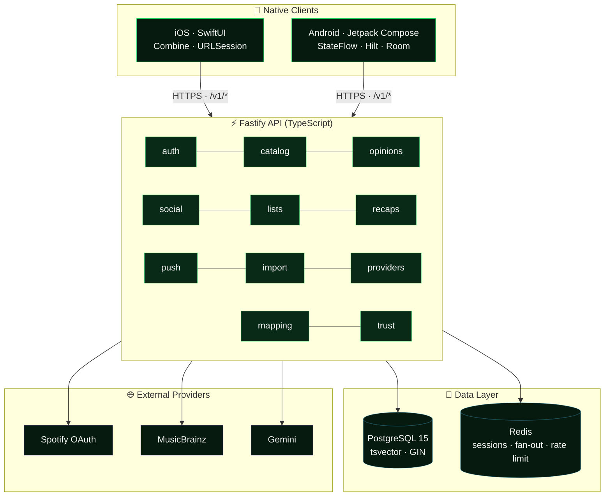

**Defining properties**

- **36 API routes** across **11 domain modules** (`auth`, `catalog`, `opinions`, `social`, `lists`, `recaps`, `push`, `import`, `providers`, `mapping`, `trust`)
- **Shared Zod contracts** in `packages/contracts/` — one source of truth for request/response shapes across Android, iOS, and backend
- **Idempotency-key enforcement** on every mutating route
- **Redis-cached** feed fan-out, sessions, rate limiting
- **Postgres full-text search** via `tsvector` + `GIN` indexes (album/artist lookup lands in **&lt;90 ms p95**)

### Rating mutation · lifecycle

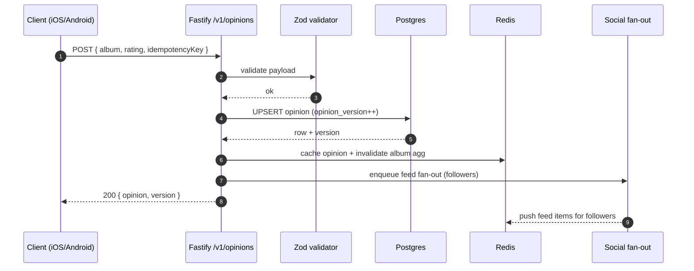

### Opinion state

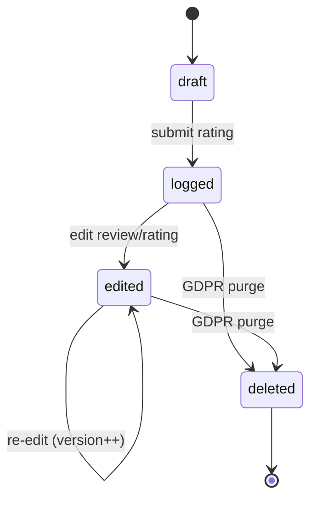

---

## 🔥 Feature spotlights

### A real rating system · not five stars

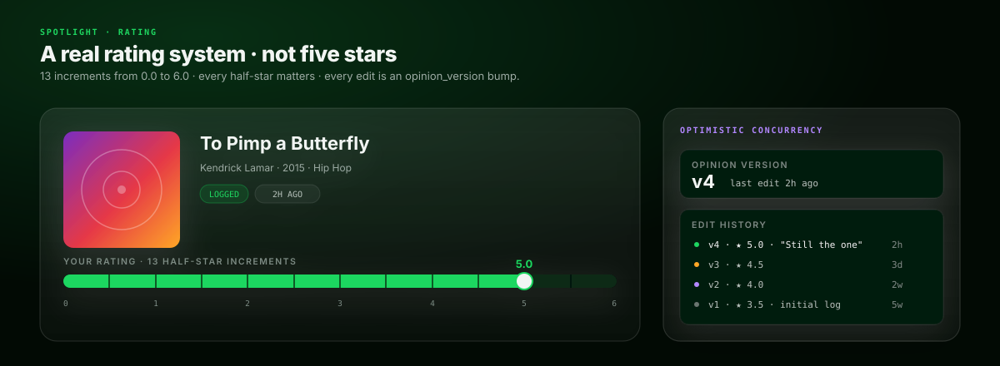

Thirteen increments from **0.0 to 6.0**. Every half-star matters. Every edit bumps `opinion_version` so concurrent edits can't clobber each other — the server resolves with optimistic concurrency and returns the authoritative version.

### Social feed that's actually fast

The `social` module writes to per-user feed keys in Redis when a followed user logs an album, reacts, or publishes a list. Clients read a prebuilt feed instead of querying the graph — **no N+1 fan-out at read time**. Expiry is capped so cold followers don't blow up memory.

### 6 themes · whole-app reskin

The iOS `ThemeManager` publishes an `AccentTheme` (Emerald · Bonfire · Rose · Amethyst · Midnight · Gilt). Every screen binds to `ThemeManager.shared.primary` / `secondary` / `colors.darkBase`. Picking a theme in Settings re-renders the entire app — backdrop glows, album gradient overlays, tab bar accents, everything.

### Gemini-powered recommendations

The backend exposes a recommendation endpoint that takes a user's rating history, sends a compact prompt to Gemini, and returns a structured list of album recs with a "because you rated X" explanation. Mobile surfacing is in progress; the API is live.

---

## 🛠️ Tech stack

| Layer | Stack |
|-------|-------|
| **iOS** | Swift · SwiftUI · Combine · URLSession |
| **Android** | Kotlin · Jetpack Compose · StateFlow · Hilt · OkHttp · Room |
| **Backend** | TypeScript · Fastify 4.x · Pino · Zod |
| **Contracts** | `packages/contracts/` — shared Zod schemas consumed by backend + type-gen for clients |
| **Database** | PostgreSQL 15 (tsvector + GIN full-text search) |
| **Cache** | Redis — sessions, feed fan-out, rate limit buckets |
| **AI** | Google Gemini (recommendation engine) |
| **Infra** | Docker Compose (local Postgres + Redis) · Railway (prod) |
| **Tooling** | Node 20 · Xcode 16+ · Android Studio · Gradle Kotlin DSL |

---

## 🚀 Getting started

### Prerequisites

- **Node.js 20+**
- **Docker** (for local Postgres + Redis)
- **Xcode 16+** (for iOS)
- **Android Studio** (for Android)

### Backend

```bash
docker compose up -d
npm install
npm run migrate --workspace backend
npm run dev --workspace backend
```

Server runs at `http://localhost:8080`.

### iOS

Open `ios/SoundScore/SoundScore.xcodeproj` in Xcode, pick a simulator, hit **Run**. The app auto-authenticates against the local backend in debug mode.

### Android

```bash
./gradlew installDebug
```

Or open the project in Android Studio and run on a device / emulator.

---

## 🗂️ Project structure

```
SoundScoreV0.1/
├── app/                    # 📱 Android app (Kotlin + Jetpack Compose)
│   └── src/main/java/
│       ├── data/           #   Repository · API client · DTOs
│       └── ui/             #   Screens · ViewModels · theme
│
├── ios/                    # 🍎 iOS app (Swift + SwiftUI)
│   └── SoundScore/
│       ├── Screens/        #   10 screens + ViewModels
│       ├── Components/     #   Reusable UI (glass cards, rating bar, etc.)
│       └── Theme/          #   6 accent themes + typography
│
├── backend/                # ⚡ Fastify API
│   └── src/
│       ├── modules/        #   11 domain modules
│       ├── lib/            #   18 shared utilities
│       └── db/             #   Schema migrations
│
├── packages/contracts/     # 📦 Shared Zod schemas
├── docs/                   # 📖 Architecture, audit logs, screenshots
└── docker-compose.yml      # 🐳 Local Postgres + Redis
```

---

## 📊 Stats

<div align="center">

| | Android | iOS | Backend |
|---|:---:|:---:|:---:|
| **Source files** | **33** | **67** | **45** |
| **Lines of code** | ~4,900 | ~8,300 | ~5,500 |
| **API routes wired** | 18 | 22 | **36** |
| **Domain modules** | — | — | **11** |
| **Themes** | — | **6** | — |
| **Tests** | — | — | ~96 |

</div>

---

## 🎨 Design tokens

| Token | Value | Used for |
|-------|-------|----------|
| `darkBase` | `#020A04` → `#0A0802` (per-theme) | App background |
| `darkSurface` | `#061A10` → theme variant | Card / list surface |
| `darkElevated` | `#0A2A18` → theme variant | Modals, sheets |
| `glassBg` | `rgba(255,255,255,0.07)` | Glass morphism cards |
| `glassBorder` | `rgba(255,255,255,0.18)` | Glass edges |
| `accentEmerald` | `#1ED760` | Primary (default theme) |
| `accentAmethyst` | `#B388FF` | Purple theme / violet semantic |
| `accentBonfire` | `#FF8C42` | Orange theme |
| `accentRose` | `#FF6B8A` | Pink theme |
| `accentMidnight` | `#4FC3F7` | Blue theme |
| `accentGilt` | `#FFD54F` | Gold theme |

---

## 🤝 Contributing

This started as a solo sandbox project. If you want to pick it up, extend it, or fork it as a foundation — go for it.

**Areas that could use work:**

- [ ] Android parity with iOS (5 screens still missing)
- [ ] Phase 2 Spotify integration on mobile clients
- [ ] Surface Gemini recs in the UI
- [ ] Test coverage (currently backend-only, ~96 tests)
- [ ] CI / CD pipeline hardening

### Branch strategy

| Branch prefix | Purpose |
|--------------|---------|
| `main` | Stable |
| `feat/<description>` | New features |
| `fix/<description>` | Bug fixes |

### Commit format

```
<type>: <description>
```

Types: `feat` · `fix` · `refactor` · `docs` · `test` · `chore` · `perf` · `ci`

---

## 🔗 Related

- **[SoundScore Web (Legacy)](https://github.com/madhavcodez/SoundScore)** — the original 2025 web prototype (React + Express + MongoDB). Archived as a reference.

---

<div align="center">

### 📄 License

MIT · Built by [**@madhavcodez**](https://github.com/madhavcodez)

_Log what you listen to. Share what you love._

</div>
